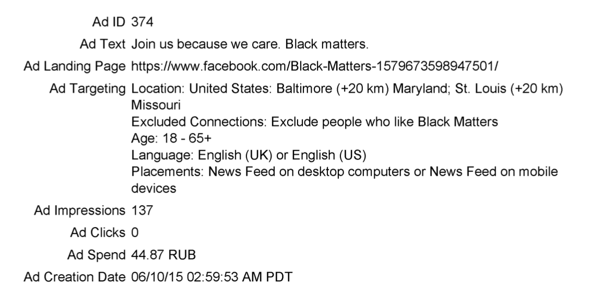

# A5: 2016 Facebook's Russian ads analysis

Benjamin Brodeur Mathieu  
University of Washington  
12/07/2019

## Abstract

This analysis reviews the IRA's (Internet Research Agency) use of Facebook ads to further their political agenda by interfering with the 2016 US presidential election. We first examined whether some of the targeted demographics were more or less engaged with the IRA ads. It was found that nearly all demographics were at lest four times more likely to engage with an IRA ad than the average Facebook ad. The demographics most likely to interact were Mexican-Americans, Native-Americans and African-Americans while the least likely to interact were Self-Defense (Martial arts) advocacy groups, Muslim-Americans and groups who interested in free music software.

We then examined how different demographics had been targeted near important political events. Our findings suggests that the IRA infiltrated and created Facebook groups and communities which caused discord in public political discourse. These same groups obtained credibility by creating rallies and events on the ground in the United-States. Some groups ultimately leveraged their following to spread messages meant to suppress voter turnout near election day.

This analysis complements other studies on the subject by using a primarily human-centered approach. Using a purely algorithmic method to cluster the demographics would have lost the richness of cultural associations the IRA leveraged to target the groups. Similarly, spikes in data were put in the context of these demographics and the political events.

## Repository structure
```
├── A4-Final-project-proposal.md
├── A5-Final-project-plan.md
├── LICENSE
├── README.md
├── assets
│   └── pictures
├── clean_data
│   ├── clean_data.csv
│   └── labeled_clean_data.csv
├── raw_data
│   ├── 2015-06
│       ├── P(1)0000054.pdf
│   ├── txt_files
│   └── raw.csv
└── src
    ├── [TEST]_k_means_demographic_labeling.ipynb
    ├── analysis.ipynb
    ├── data_cleaning.ipynb
    ├── demographic_labeling.ipynb
    └── pdf_data_extraction.ipynb
```

| File                                          | Description                                                                                                |
| --------------------------------------------- | ---------------------------------------------------------------------------------------------------------- |
| A4-Final-project-proposal.md                  | Original proposal for this assignment.                                                                     |
| A5-Final-project-plan.md                      | Improved final plan for this assignment.                                                                   |
| LICENSE                                       | Code license                                                                                               |
| README.md                                     | This readme.                                                                                               |
| assets/pictures/                              | Directory containing the various images displayed in the analysis notebook                                 |
| clean_data/clean_data.csv                     | CSV file containing a cleaned version of our dataset.                                                      |
| clean_data/labeled_clean_data.csv             | CSV file containing a cleaned version of our dataset, with the addition of a demographic column.           |
| raw_data/2015-06/P(1)0000054.pdf              | Sample ad that can be used to test the `pdf_data_extraction.ipynb`.                                          |
| raw_data/txt_files/*                          | Text files of the first page of every ad's pdf. Generated by the `pdf_data_extraction.ipynb`.                  |
| raw_data/raw.csv                              | Raw data obtained by parsing txt_files in `pdf_data_extraction.ipynb`. Primary input of `data_cleaning.ipynb`. |
| src/[TEST]_k_means_demographic_labeling.ipynb | Contains an attempt at using k-means and tfidf to add demographic labels to the IRA ads.                   |
| src/analysis.ipynb                            | Contains the report and analysis code / visualizations.                                                    |
| src/data_cleaning.ipynb                       | Contains the logic to clean `raw.csv` produces `clean_data.csv`.                                           |
| src/demographic_labeling.ipynb                | Contains the logic to add the "demographic" column to `clean_data.csv`.                                    |
| src/pdf_data_extraction.ipynb                 | Contains data extraction from pdf to txt to `raw.csv`.                                                     |

## Data sources used

The raw data is provided in zips of pdfs on the [HPSCI government website](https://intelligence.house.gov/social-media-content/social-media-advertisements.htm). 

> *The Facebook advertisements we are publishing today have been carefully reviewed by the Committee Minority and redacted by Facebook to protect personally-identifiable information (PII). To protect innocent victims, Facebook—at the urging of the Committee Minority—also has notified users whose genuine online events were unwittingly promoted by the IRA.* - [HPSCI](https://intelligence.house.gov/social-media-content/)

Each pdf files contained two pages. A first page with the description of the ad and the relevant information for this exercise (see image below). A second page containing an image of the ad.



| field                             | description                                  |
| --------------------------------- | -------------------------------------------- |
| ad_id                             | Unique number for the ad                     |
| ad_text                           | Text visible on the ad                       |
| ad_landing_page                   | Hyperlink for ad click                       |
| ad_targeting_location             | Targeted location by the ad                  |
| ad_targeting_excluded_connections | Ad not shown criteria                        |
| ad_targeting_age                  | Targeted age group                           |
| ad_targeting_language             | Targeted language                            |
| ad_targeting_placements           | Targeted placement on page / in app          |
| ad_impressions                    | Number of users who scrolled by / saw the ad |
| ad_clicks                         | Number of clicks on ad                       |
| ad_spend                          | Money spend on ad with currency string       |
| ad_creation_date                  | Creation date of the ad                      |


* Data was accessed on 11/05/2019
* Released under a public license

### How to obtain the raw_data

1. Download the ads from the [HSPCI](https://intelligence.house.gov/social-media-content/social-media-advertisements.htm) website
2. Place the unzipped files according to the directory structure below under the raw_data folder:

```
./raw_data/
├── 2015-06
├── 2015-q3
├── 2015-q4
├── 2016-q1
├── 2016-q2
├── 2016-q3
├── 2016-q4
├── 2017-04
├── 2017-05
├── 2017-q1
└── 2017-q3
```

3. Follow the instructions below to run the `pdf_data_extraction.ipynb` notebook.

## How to run the notebook

You will need a computer with access to the internet and access to a command line which has the required privileges to install open-source software.

> The RussianAds.yml file was created on OSX and will not work on linux or windows. If you are not on OSX, install the dependencies manually.

1. Install [conda or miniconda](https://docs.conda.io/projects/conda/en/latest/user-guide/install/).
2. [Replicate the conda environment](https://docs.conda.io/projects/conda/en/latest/user-guide/tasks/manage-environments.html#creating-an-environment-from-an-environment-yml-file) using the human.yml file provided by running: `conda env create -f RussianAds.yml`
3. Activate the environment with: `conda activate RussianAds`
4. Using a terminal or cmd, navigate to the src folder.
5. Lauch jupyter by running: `jupyter notebook`
6. Select the notebook of interest. (Start at `pdf_data_extraction.ipynb` for the full process or `analysis.ipynb` for the final report.)

## Bias

* We know from various sources and studies that the ads provided by Facebook are likely to only represent a fraction of the ads created by the IRA and other groups.
* The ads were not all perfectly formatted. Some ads were simply not processed beyond basic parsing for this reason.
* Ads lacking a start date were not analyzed.
* Ads without a spending amount, impressions and/or clicks were also excluded as it is unlikely that these were published on the platform at all.
* The process by which demographics were clustered is subjective, however this project attempted to give a transparent account of how these demographics were created from the dataset.
* The analysis is biased by my desire to create a narrative that summarizes my findings and is easy to follow, in reality many ads were nonsensical or difficult to interpret without further research.

## Resources used

This analysis was prepared using Python 3.7.5 running in a Jupyter Notebook environment.  
Documentation for Python can be found here: https://docs.python.org/3.7/  
Documentation for Jupyter Notebook can be found here: http://jupyter-notebook.readthedocs.io/en/latest/  

To extract the data we used the [xpdf](http://www.xpdfreader.com/about.html) pdf reader cli pdftotext.

The following Python packages were used and their documentation can be found at the accompanying links:

* [pandas](https://pandas.pydata.org/)
* [numpy](https://numpy.org/)
* [IPython](https://ipython.org/)
* [matplotlib](https://matplotlib.org/)
* [seaborn](https://seaborn.pydata.org/)

## Files Created

This notebooks create 3 CSV files of data extracted and compiled as part of this analysis.

* `raw_data/raw.csv`
* `clean_data/clean_data.csv`
* `clean_data/labeled_clean_data.csv`

The 3 files share a very similar schema. Here are the notable exceptions:

* The `ad_age` and `ad_targeting_people_who_match` columns are only available in the `raw.csv` file.
* The Data type for all columns of the `raw.csv` is string.
* The `demographic` column is only available in the `labeled_clean_data.csv` file.

| Column                        | Description | Data type                                                                                      |
| ----------------------------- | ----------- | ---------------------------------------------------------------------------------------------- |
| file_name                     | string      | Unique pdf file name                                                                           |
| ad_targeting_interests        | string      | Interests used to target users                                                                 |
| ad_impressions                | int         | Number of users who saw the ads                                                                |
| ad_clicks                     | int         | Number of times the ads was clicked                                                            |
| ad_spend                      | float       | Money spent on the ad in RUB                                                                   |
| ad_creation_date              | datetime    | Creation date of the ad                                                                        |
| ad_end_date                   | datetime    | Date at which the ad stopped                                                                   |
| demographic                   | string      | Demographic of group targeted by the ad based on analysis of the ad_targeting_interests column |
| ad_age                        | string      | Age range used for ad targeting. (Only in `raw.csv`)                                           |
| ad_targeting_people_who_match | string      | Ad targeting used with the "people who match" filtering.                                       |

## Course wiki

This analysis was conducted in the context of [Data-512A Human-Centered Data-Science](https://wiki.communitydata.science/Human_Centered_Data_Science_(Fall_2019)) at the University of Washington.

